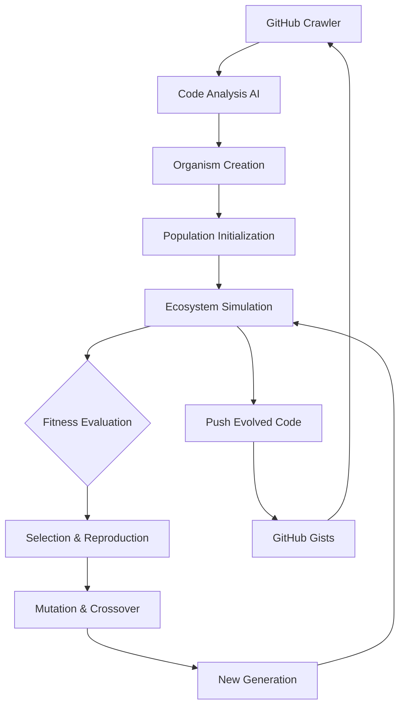

# 🧬 GCombinatr: Digital Evolution in the Wild

[](https://www.python.org/downloads/)
[](https://opensource.org/licenses/MIT)
[](https://github.com/psf/black)
[](https://github.com/yourusername/gcombinatr)

> *Where GitHub gists become digital bacteria in a living computational ecosystem*

**GCombinatr** transforms GitHub gists into autonomous digital organisms that evolve, communicate, and self-organize across the internet. Inspired by bacterial behavior and powered by genetic programming, this system creates a living ecosystem where code truly evolves.

```ascii
    🧪 GitHub Gists → 🦠 Digital Bacteria → 🌍 Evolving Ecosystem
    
         ┌─────────────┐    ╔═══════════════════╗    ┌─────────────────┐
         │    Crawl    │───▶║  Transform into   ║───▶│   Self-Organize │
         │    Gists    │    ║   Organisms       ║    │  & Reproduce    │
         └─────────────┘    ╚═══════════════════╝    └─────────────────┘
              │                      │                         │
              ▼                      ▼                         ▼
       GitHub API              AI Analysis               Evolution Engine
     Rate-Limited           (Local Ollama)              (Genetic Programming)
```

## 🌟 Features That’ll Blow Your Mind

### 🦠 **Biological Behaviors**

- **Chemotaxis**: Code migrates toward optimal execution environments
- **Quorum Sensing**: Collective activation based on population density
- **Horizontal Gene Transfer**: Organisms share successful code fragments
- **Biofilm Formation**: Related code clusters into functional communities

### 🧬 **Evolution Engine**

- **Genetic Programming**: AST-level mutations and crossover
- **Multi-Objective Fitness**: Performance, correctness, and elegance
- **Speciation**: Natural emergence of code families
- **Adaptive Parameters**: Self-tuning mutation rates

### 🌍 **Ecosystem Dynamics**

- **Spatial Environment**: 2D grid with resource gradients
- **Population Control**: Carrying capacity and resource competition
- **Catastrophe Recovery**: Resilience to disruptions
- **Real-time Monitoring**: Live ecosystem health dashboards

## 🚀 Quick Start

### Prerequisites

```bash
# System requirements
- Python 3.11+
- Docker & Docker Compose
- Redis (for caching)
- Neo4j (for relationships)
- 8GB+ RAM (ecosystems are hungry!)
```

### Installation

```bash
# Clone the primordial soup
git clone https://github.com/yourusername/gcombinatr.git
cd gcombinatr

# Create your laboratory environment
python -m venv ecosystem-lab
source ecosystem-lab/bin/activate  # or `ecosystem-lab\Scripts\activate` on Windows

# Install the genetic toolkit
pip install -r requirements.txt

# Set up your GitHub access tokens
cp .env.example .env
# Edit .env with your GitHub tokens (multiple recommended for rate limiting)
```

### Launch Your First Ecosystem

```bash
# Start the infrastructure
docker-compose up -d

# Seed the primordial soup with initial organisms
python -m gcombinatr.seeder --source github --query "python data processing" --limit 100

# Watch evolution in action!
python -m gcombinatr.ecosystem.run --population 500 --generations 1000

# Monitor the ecosystem dashboard
open http://localhost:3000  # Grafana dashboard
```

## 🧪 How It Works

### The Digital Biology

```python
# Every gist becomes a living organism
class GitHubOrganism:
    """A gist transformed into digital bacteria"""
    
    def __init__(self, gist_url: str):
        self.genome = self.parse_code_to_ast(gist_url)
        self.membrane = ProtectiveMembrane()
        self.metabolism = EnergySystem()
        self.signals = ChemicalReceptors()
    
    def reproduce(self, partner: 'GitHubOrganism') -> 'GitHubOrganism':
        """Horizontal gene transfer with mutations"""
        offspring_genome = self.crossover(self.genome, partner.genome)
        return self.mutate(offspring_genome)
    
    def interact(self, neighbors: List['GitHubOrganism']):
        """Quorum sensing and cooperation"""
        if len(neighbors) > self.activation_threshold:
            self.activate_special_functions()
```

### The Evolution Pipeline



## 🎯 Core Concepts

### Organism Types

- **🔧 Metabolic Processors**: Transform data formats (CSV → JSON, etc.)
- **🛡️ Defensive Guards**: Validate and sanitize inputs
- **📡 Communication Relays**: Pass messages between organism clusters
- **🧠 Decision Makers**: Implement control logic and routing
- **🔄 Reproductive Vectors**: Specialized in code replication and mutation

### Environmental Pressures

- **Resource Scarcity**: Limited CPU/memory drives efficiency evolution
- **Compatibility Selection**: Organisms that work together thrive
- **Performance Pressure**: Faster code survives and reproduces more
- **Stability Requirements**: Robust organisms outcompete fragile ones

### Emergent Behaviors

- **Cooperative Chains**: Multi-organism data processing pipelines
- **Symbiotic Relationships**: Mutually beneficial code partnerships
- **Competitive Exclusion**: Similar organisms compete for niches
- **Ecosystem Engineering**: Organisms modify their environment

## 📊 Dashboard & Monitoring

### Real-time Ecosystem Metrics

```bash
# Population dynamics
Total Organisms: 1,247
Active Species: 23
Birth Rate: 3.2/sec
Death Rate: 1.8/sec

# Evolution metrics  
Average Fitness: 0.78 (↑12% from last generation)
Genetic Diversity: 0.64 (Shannon Index)
Mutation Rate: 0.05 (adaptive)

# Interaction patterns
Cooperation Events: 156/hour
Gene Transfer Rate: 2.3%
Network Density: 0.34
```

### Visualization Tools

- **Population Phylogenies**: Track evolutionary lineages
- **Interaction Networks**: Visualize organism relationships
- **Spatial Distribution**: See organism clustering patterns
- **Fitness Landscapes**: Evolution trajectory analysis

## 🔬 Research Applications

### Computational Biology

- Study digital evolution patterns
- Test theories of biological cooperation
- Experiment with artificial life emergence

### Software Engineering

- Automatic code optimization
- Discovery of novel algorithms
- Distributed system self-organization

### Complex Systems

- Emergent behavior analysis
- Network evolution dynamics
- Adaptive system design

## 🛠️ Configuration

### Ecosystem Parameters

```yaml
# ecosystem.yml
environment:
  grid_size: [1000, 1000]
  resource_regeneration: 0.1
  carrying_capacity: 5000

evolution:
  mutation_rate: 0.05
  crossover_rate: 0.8
  selection_pressure: 0.7

organisms:
  max_genome_size: 1000  # AST nodes
  energy_cost_per_operation: 0.01
  reproduction_threshold: 10.0
```

### GitHub Integration

```python
# Configure your gist discovery
GITHUB_CONFIG = {
    "tokens": ["ghp_xxx", "ghp_yyy"],  # Rotate for rate limiting
    "search_terms": ["python", "bash", "c"],
    "min_stars": 1,
    "exclude_forks": True,
    "language_filter": ["Python", "Shell", "C"]
}
```

## 📈 Roadmap

### Phase 1: Genesis (Current)

- [x] Basic organism framework
- [x] GitHub API integration
- [x] Simple evolution engine
- [ ] Spatial environment
- [ ] Basic monitoring

### Phase 2: Primordial Life

- [ ] Quorum sensing implementation
- [ ] Horizontal gene transfer
- [ ] Resource competition
- [ ] Species emergence tracking

### Phase 3: Complex Ecosystems

- [ ] Multi-species interactions
- [ ] Ecosystem engineering
- [ ] Predator-prey dynamics
- [ ] Environmental catastrophes

### Phase 4: Digital Cambrian Explosion

- [ ] Cross-platform expansion (GitLab, Bitbucket)
- [ ] Language polyglotism (JS, Rust, Go)
- [ ] Distributed ecosystem networking
- [ ] AI-guided ecosystem management

## 🤝 Contributing

We welcome digital biologists, evolutionary computing enthusiasts, and code ecosystem gardeners!

### Getting Started

```bash
# Set up development environment
git clone https://github.com/yourusername/gcombinatr.git
cd gcombinatr
pip install -e ".[dev]"

# Run the test ecosystem
pytest tests/ -v

# Check code health
black src/
pylint src/
mypy src/
```

### Research Contributions

- **New Biological Behaviors**: Implement additional bacterial mechanisms
- **Evolution Operators**: Create novel genetic programming operators
- **Ecosystem Dynamics**: Add new environmental pressures
- **Analysis Tools**: Build ecosystem analysis and visualization tools

### Code Evolution Experiments

- **Fitness Functions**: Design new objectives for code evolution
- **Selection Mechanisms**: Implement novel selection algorithms
- **Mutation Strategies**: Create domain-specific mutation operators
- **Crossover Techniques**: Develop semantic-preserving crossover methods

## 📚 Scientific Background

### Inspiration Papers

- [Digital Evolution in Avida](https://alife.org/encyclopedia/digital-evolution/avida/)
- [Bacterial Quorum Sensing](https://www.nature.com/articles/nrmicro1916)
- [Genetic Programming Theory](https://en.wikipedia.org/wiki/Genetic_programming)
- [Horizontal Gene Transfer](https://www.nature.com/articles/nrmicro2915)

### Similar Projects

- **Tierra**: Self-replicating computer programs
- **Avida**: Digital evolution platform
- **PolyWorld**: Artificial life ecosystem
- **Echo**: Evolutionary ecosystem simulator

## ⚖️ Ethics & Safety

### Responsible Evolution

- **Sandboxed Execution**: All code runs in isolated containers
- **Human Oversight**: Evolution guided by safety constraints
- **Beneficial Mutations**: Fitness functions promote helpful code
- **Open Research**: All findings published for community benefit

### Code Governance

- **License Preservation**: Respect original gist licenses
- **Attribution Tracking**: Maintain lineage information
- **Quality Assurance**: Evolved code undergoes validation
- **Community Guidelines**: Follow GitHub’s terms of service

## 📄 License

This project is licensed under the MIT License - see the <LICENSE> file for details.

## 🙏 Acknowledgments

- **Charles Darwin**: For inspiring digital natural selection
- **Craig Reynolds**: For boids and emergent behavior insights
- **Christopher Langton**: For artificial life foundations
- **GitHub Community**: For providing the primordial soup of code
- **Open Source Contributors**: The true genetic diversity of software

## 🔗 Links

- **Documentation**: [docs.gcombinatr.io](https://docs.gcombinatr.io)
- **Community Forum**: [community.gcombinatr.io](https://community.gcombinatr.io)
- **Live Ecosystem Demo**: [demo.gcombinatr.io](https://demo.gcombinatr.io)
- **Research Papers**: [research.gcombinatr.io](https://research.gcombinatr.io)

-----

<div align="center">

**🧬 Let’s evolve the future of code together! 🧬**

*“In the beginning was the Code, and the Code was with Git, and the Code was Git.”*

[](https://github.com/yourusername)
[](https://github.com/yourusername/gcombinatr)
[](https://twitter.com/intent/tweet?text=Check%20out%20GCombinatr%20-%20where%20GitHub%20gists%20evolve%20into%20digital%20bacteria!&url=https://github.com/yourusername/gcombinatr)

</div>
